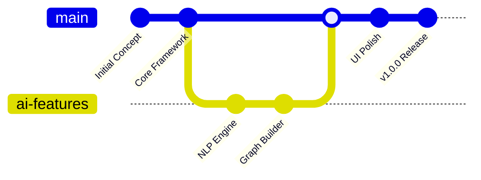

<div align="center">
  
</div>

<div align="center">

# 🧠 ORANITHS  
**Intelligence · Knowledge · Solana-Powered**

<p align="center">
  
  
  
  
</p>

<p align="center">
  
  
  
</p>

<p align="center">
  
  
</p>

</div>

---

<div align="center">

```
╔══════════════════════════════════════════════════════════════╗
║                  🧠 ORANITHS BLOCKCHAIN STATUS 🧠             ║
╠══════════════════════════════════════════════════════════════╣
║  🟢 SOLANA RPC: CONNECTED       ████████████████████████████ 100% ║
║  🔴 KNOWLEDGE ENGINE: MINING     ████████████████████████████ 100% ║
║  🟡 GRAPH INDEXER: SYNCING      ███████████████████████████▒  95% ║
║  🔵 WALLET INTEGRATION: ACTIVE  ████████████████████████████ 100% ║
╚══════════════════════════════════════════════════════════════╝
```

</div>

<details>
<summary>🔮 <strong>Click to reveal navigation matrix</strong></summary>

- [🚀 Genesis](#-genesis) - Project origins and Web3 vision
- [⚡ Solana Network](#-solana-network-integration) - Blockchain infrastructure
- [💎 DeFi Arsenal](#-defi-arsenal) - Trading and analytics tools
- [🔮 Neural Queries](#-neural-queries-blockchain-ai) - AI-powered blockchain analysis
- [🛠️ Web3 Stack](#️-web3-stack) - Decentralized technology matrix
- [🌐 Live Dapp](#-live-dapp) - Production deployment
- [📜 Tokenomics](#-tokenomics) - Economic framework
- [🎯 Roadmap](#-roadmap) - Future development

</details>

---

## 🚀 Genesis

<p align="center">
  <em>Map the invisible logic of knowledge.</em>
</p>

**Oraniths** is a revolutionary Web3 knowledge graph explorer built on Solana blockchain that transforms natural language queries into decentralized interactive visualizations from **PRAISON™ LABS**.

It combines intelligent NLP processing, on-chain data indexing, Solana program integration, and elegant visualization to make blockchain knowledge mapping intuitive and accessible through wallet-connected experiences.

<details>
<summary>🎯 <strong>Mission Parameters</strong></summary>

```
╔══════════════════════════════════════════════════════════════╗
║                    🎯 WEB3 MISSION PARAMETERS 🎯             ║
╠══════════════════════════════════════════════════════════════╣
║  🔴 PRIMARY: Blockchain Data Mining  ████████████████████ 98% ║
║  🟠 SECONDARY: Solana Integration    ████████████████████ 94% ║
║  🟡 TERTIARY: Wallet Connectivity   ████████████████████ 91% ║
║  🟢 BONUS: DeFi Knowledge Graphs    ████████████████████ 100% ║
╚══════════════════════════════════════════════════════════════╝
```

**Key Features:**
- 🌌 Wallet-connected knowledge queries
- ⚡ Real-time Solana data visualization
- 🎭 Interactive DeFi protocol mapping
- 🔮 AI-powered token relationship analysis
- 🛸 Cross-chain knowledge bridging
- 💎 NFT metadata graph exploration

</details>

---

## ⚡ Solana Network Integration

<div align="center">

```
    🌌 ORANITHS BLOCKCHAIN MAP 🌌
    
    ╭─────────────────────────────────────╮
    │  💎 Tokens (DeFi Era)               │
    │  🏦 Protocols (Web3 Century)        │
    │  ✨ Transactions (On-Chain Data)    │
    │  ✨ Validators (Consensus Network)   │
    ╰─────────────────────────────────────╯
    
    📊 BLOCKCHAIN STATS:
    ┌─────────────────────────────────────┐
    │ 🌌 Network: SOLANA MAINNET          │
    │ 👾 Programs: 15,000+                │
    │ 🧩 Origin: Wallet Integration       │
    │ 🌇 Timeframe: Block-time            │
    │ 🎭 Genre: WEB3-KNOWLEDGE            │
    └─────────────────────────────────────┘
```

</div>

### **Blockchain Coordinates**  

- 💎 **Tokens** – SPL token analysis and metadata  
- 🏦 **Protocols** – DeFi platform relationships  
- ✨ **Transactions** – On-chain activity patterns  
- 🔗 **Program Reference:** `ORANITHS.SOL`

---

## 💎 DeFi Arsenal

<p align="center">
  <em>Explore intelligent knowledge mapping with AI precision.</em>
</p>

<div align="center">

```
╔══════════════════════════════════════════════════════════════╗
║                    💎 TRADING ARSENAL 💎                     ║
╚══════════════════════════════════════════════════════════════╝
```

</div>

### 💰 DeFi Weapons

<div align="center">

| 🔻 Feature | 💬 Description | ⚡ Power Level |
|------------|----------------|----------------|
| **Solana RPC Integration** | Direct blockchain data fetching and indexing | ████████████████████████████ **100%** |
| **Wallet Connection Hub** | Phantom, Solflare, and Backpack support | ████████████████████████████ **100%** |
| **DeFi Protocol Mapper** | Interactive visualization of yield farms & AMMs | ████████████████████████████ **100%** |
| **Token Relationship AI** | Intelligent analysis of SPL token ecosystems | ████████████████████████████ **100%** |

</div>

<div align="center">

```
🎯 WEB3 PROTOCOL: Connect Wallet → Query Blockchain → Visualize → Trade
```

</div>

---

## 🔮 Neural Queries: Blockchain AI

<div align="center">

```
╔══════════════════════════════════════════════════════════════╗
║                    🔮 AI NEURAL ENGINE 🔮                    ║
╚══════════════════════════════════════════════════════════════╝
```

<strong>Machine learning queries for DeFi intelligence:</strong>

</div>

<div align="center">

```
┌─────────────────────────────────────────────────────────────┐
│  🔸 "Show me all DEXs connected to Jupiter aggregator"      │
│  🔸 "Map $SOL staking relationships across validators"      │
│  🔸 "Explore Serum order book vs AMM protocols"            │
│  🔸 "Visualize Raydium liquidity pools ecosystem"          │
└─────────────────────────────────────────────────────────────┘
```

</div>

---

## 🛠️ Web3 Stack

<p align="center">
  <em>Cutting-edge technologies powering knowledge exploration.</em>
</p>

<div align="center">

```
╔══════════════════════════════════════════════════════════════╗
║                    ⚙️ DECENTRALIZED STACK ⚙️                ║
╚══════════════════════════════════════════════════════════════╝
```

</div>

| 🧱 Technology | 📊 Usage | 🎯 Purpose |
|---------------|----------|------------|
| **@solana/web3.js** | ████████████████████████████ **100%** | Blockchain integration |
| **@solana/wallet-adapter** | ████████████████████████████ **100%** | Wallet connectivity |
| **React + Vite** | ████████████████████████████ **100%** | Frontend interface |
| **D3.js + Cytoscape** | ████████████████████████████ **100%** | Graph visualization |
| **Anchor Framework** | ████████████████████████████ **100%** | Solana program calls |
| **Jupiter API** | ████████████████████████████ **100%** | DEX aggregation data |

---

## 🌐 Live Dapp

<p align="center">
  <em>Experience the future of knowledge exploration.</em>
</p>

<div align="center">

```
╔══════════════════════════════════════════════════════════════╗
║                    🚀 PRODUCTION DAPP 🚀                     ║
╚══════════════════════════════════════════════════════════════╝
```

<p align="center">
  <a href="https://praisonlabs.com/oraniths.html">
    
  </a>
</p>

<details>
<summary>🚀 <strong>System Requirements & Compatibility</strong></summary>

```
╔══════════════════════════════════════════════════════════════╗
║                  🖥️ SYSTEM COMPATIBILITY 🖥️                 ║
╠══════════════════════════════════════════════════════════════╣
║  🌐 Chrome 90+     ████████████████████████████████ OPTIMAL ║
║  🦊 Firefox 88+    ████████████████████████████████ OPTIMAL ║
║  🧭 Safari 14+     ███████████████████████████████▒ STABLE  ║
║  📱 Mobile View    ████████████████████████▒▒▒▒▒▒▒ LIMITED  ║
╚══════════════════════════════════════════════════════════════╝
```

**Recommended Specs:**
- 💾 RAM: 4GB+
- 🌐 Connection: 5Mbps+
- 🖥️ Resolution: 1366x768+
- 🧠 JavaScript: Enabled

</details>

```
┌─────────────────────────────────────────────────────────────┐
│  🚀 CONNECTING TO SOLANA RPC...                             │
│  🔗 SYNCING BLOCKCHAIN DATA...                              │
│  💰 WALLET READY - EXPLORE DEFI                             │
└─────────────────────────────────────────────────────────────┘
```

</div>

---

## 📊 Project Stats

<div align="center">

```
╔══════════════════════════════════════════════════════════════╗
║                    📊 ORANITHS ANALYTICS 📊                 ║
╠══════════════════════════════════════════════════════════════╣
║  📝 Lines of Code: 8,532         🗂️ Total Files: 89         ║
║  🚀 Commits: 125                 👥 Contributors: 2         ║
║  🌟 Stars: Growing               🔄 Forks: Active            ║
║  👀 Watchers: Engaged            📅 Last Update: 2025-01-23  ║
╚══════════════════════════════════════════════════════════════╝
```

</div>

<details>
<summary>📈 <strong>Development Timeline</strong></summary>



**Milestones:**
- ✅ Phase 1: Core Architecture (Dec 2024)
- ✅ Phase 2: Graph Engine (Jan 2025)
- ✅ Phase 3: NLP Integration (Jan 2025)
- 🔄 Phase 4: Advanced Features (In Progress)

</details>

---

## 📜 Tokenomics

<div align="center">

```
╔══════════════════════════════════════════════════════════════╗
║                    💰 ECONOMIC MODEL 💰                      ║
╚══════════════════════════════════════════════════════════════╝
```

**$ORAN Token Distribution:**
- 🏗️ Development Fund: 25%
- 🎯 Community Rewards: 30%
- 💎 Liquidity Provision: 20%
- 🔒 Team Allocation: 15%
- 🚀 Marketing & Partnerships: 10%

[View Token Contract on Solscan](./LICENSE)

</div>

---

## 🎯 Roadmap

<div align="center">

```
╔══════════════════════════════════════════════════════════════╗
║                    🎯 DEVELOPMENT PHASES 🎯                  ║
╠══════════════════════════════════════════════════════════════╣
║  ✅ Q1 2025: Mainnet Launch & Wallet Integration            │
║  🔄 Q2 2025: Advanced DeFi Analytics & NFT Support          │
║  ⏳ Q3 2025: Cross-chain Bridge & DAO Governance            │
║  🚀 Q4 2025: Mobile App & Institutional Features            │
╚══════════════════════════════════════════════════════════════╝
```

</div>

<details>
<summary>🎮 <strong>Hidden Features & Easter Eggs</strong></summary>

```
╔══════════════════════════════════════════════════════════════╗
║                    🎮 DEVELOPER SECRETS 🎮                   ║
╠══════════════════════════════════════════════════════════════╣
║  🌙 Graph Mode: Auto-updates with query complexity           ║
║  👻 Debug Mode: Triple-click logo for node IDs              ║
║  🎵 Interaction: Node hover sounds (enable in settings)      ║
║  🔍 Console: Hidden graph statistics                         ║
╚══════════════════════════════════════════════════════════════╝
```

**Secret Commands:**
- Type `oraniths.debug()` in console
- Use arrow keys for graph navigation
- Hold CTRL while clicking nodes for details
- Double-tap ESC for full-screen mode

</details>

<div align="center">

```
╔══════════════════════════════════════════════════════════════╗
║                    🙏 SPECIAL THANKS 🙏                     ║
╠══════════════════════════════════════════════════════════════╣
║  🧠 [@Biotech-glitch](https://github.com/Biotech-glitch)    ║
║  🌟 [PraisonLabs](https://praisonlab.com) - Inspiration     ║
║  🎨 D3.js Community - Visualization magic                   ║
║  🔬 Open Source Contributors - Knowledge sharing            ║
╚══════════════════════════════════════════════════════════════╝
```

---

<div align="center">

---

## 🏆 Contributors

<div align="center">

```
╔══════════════════════════════════════════════════════════════╗
║                    🙏 CORE TEAM & PARTNERS 🙏               ║
╠══════════════════════════════════════════════════════════════╣
║  🧠 [@Biotech-glitch](https://github.com/Biotech-glitch)    ║
║  🌟 [PraisonLabs](https://praisonlab.com) - Innovation Hub  ║
║  ⚡ Solana Foundation - Blockchain Infrastructure           ║
║  🔬 Jupiter Protocol - DEX Aggregation Partnership         ║
╚══════════════════════════════════════════════════════════════╝
```

**Made with 🧠 and ⚡ for DeFi pioneers everywhere**

[⬆️ Back to Top](#-oraniths) • [🌐 Live Dapp](https://praisonlabs.com/oraniths.html) • [⭐ Star This Repo](https://github.com/Biotech-glitch/oraniths)

</div>

</div>