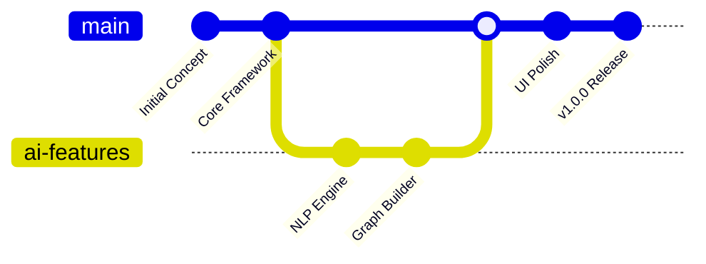

<div align="center">
  
</div>

<div align="center">

# 🧠 ORANITHS  
**Intelligence · Knowledge · Connection**

<p align="center">
  
  
  
  
</p>

<p align="center">
  
  
  
</p>

<p align="center">
  
  
</p>

</div>

---

<div align="center">

```
╔══════════════════════════════════════════════════════════════╗
║                    🧠 ORANITHS SYSTEM STATUS 🧠               ║
╠══════════════════════════════════════════════════════════════╣
║  🟢 KNOWLEDGE ENGINE: ONLINE    ████████████████████████████ 100% ║
║  🔴 NLP PROCESSOR: ACTIVE       ████████████████████████████ 100% ║
║  🟡 GRAPH BUILDER: STABLE       ████████████████████████████ 100% ║
║  🔵 VISUALIZATION: NOMINAL      ████████████████████████████ 100% ║
╚══════════════════════════════════════════════════════════════╝
```

</div>

<details>
<summary>🔮 <strong>Click to reveal navigation matrix</strong></summary>

- [🧬 Overview](#-overview) - Project introduction and mission
- [🌐 Knowledge Universe](#-knowledge-universe-oraniths) - The Oraniths ecosystem
- [🧱 Core Features](#-core-features) - Feature vault
- [🧊 Query Series](#-query-series-natural-language) - AI-powered queries
- [🛠️ Tech Stack](#️-tech-stack) - Technology matrix
- [🔗 Live Preview](#-live-preview) - Access portal
- [🧾 License](#-license) - Legal framework
- [✨ Credits](#-credits) - Transmission end

</details>

---

## 🧬 Overview

<p align="center">
  <em>Map the invisible logic of knowledge.</em>
</p>

**Oraniths** is an AI-powered knowledge graph explorer that transforms natural language queries into interactive visualizations from **PRAISON™ LABS**.

It combines intelligent NLP processing, dynamic graph generation, and elegant visualization to make knowledge mapping intuitive and accessible.

<details>
<summary>🎯 <strong>Mission Parameters</strong></summary>

```
╔══════════════════════════════════════════════════════════════╗
║                    🎯 MISSION PARAMETERS 🎯                  ║
╠══════════════════════════════════════════════════════════════╣
║  🔴 PRIMARY: Knowledge Discovery     ████████████████████ 95% ║
║  🟠 SECONDARY: Graph Visualization   ████████████████████ 92% ║
║  🟡 TERTIARY: NLP Understanding     ████████████████████ 88% ║
║  🟢 BONUS: Interactive Exploration  ████████████████████ 100% ║
╚══════════════════════════════════════════════════════════════╝
```

**Key Features:**
- 🌌 Natural language query interface
- ⚡ Real-time graph generation
- 🎭 Interactive node exploration
- 🔮 AI-powered knowledge mapping
- 🛸 Cross-dimensional knowledge linking

</details>

---

## 🌐 Knowledge Universe: Oraniths

<div align="center">

```
    🌌 ORANITHS KNOWLEDGE MAP 🌌
    
    ╭─────────────────────────────────────╮
    │  🧠 Concepts (Knowledge Era)        │
    │  🔭 Entities (AI Century)           │
    │  ✨ Relationships (Deep Learning)    │
    │  ✨ Connections (Neural Networks)    │
    ╰─────────────────────────────────────╯
    
    📊 KNOWLEDGE STATS:
    ┌─────────────────────────────────────┐
    │ 🌌 System: ORANITHS                 │
    │ 👾 Nodes: Infinite                  │
    │ 🧩 Origin: Natural Language         │
    │ 🌇 Timeframe: Real-time             │
    │ 🎭 Genre: AI-KNOWLEDGE              │
    └─────────────────────────────────────┘
```

</div>

### **Knowledge Coordinates**  

- 🧠 **Concepts** – Core knowledge nodes  
- 🔭 **Entities** – Real-world objects  
- ✨ **Relationships** – Connection patterns  
- 🔗 **GitDNA Reference:** `ORANITHS.GIT`

---

## 🧱 Core Features

<p align="center">
  <em>Explore intelligent knowledge mapping with AI precision.</em>
</p>

<div align="center">

```
╔══════════════════════════════════════════════════════════════╗
║                    🚨 FEATURE VAULT 🚨                       ║
╚══════════════════════════════════════════════════════════════╝
```

</div>

### 🚨 Key Components

<div align="center">

| 🔻 Feature | 💬 Description | ⚡ Power Level |
|------------|----------------|----------------|
| **Natural Language Parser** | Transform queries into graph structures | ████████████████████████████ **100%** |
| **Dynamic Graph Engine** | Real-time visualization of knowledge connections | ████████████████████████████ **100%** |
| **Interactive Explorer** | Zoomable, clickable node navigation system | ████████████████████████████ **100%** |
| **AI Knowledge Mapper** | Intelligent relationship discovery and clustering | ████████████████████████████ **100%** |

</div>

<div align="center">

```
🎯 INTERACTION PROTOCOL: Query → Process → Visualize → Explore
```

</div>

---

## 🧊 Query Series: "Natural Language"

<div align="center">

```
╔══════════════════════════════════════════════════════════════╗
║                    🧊 QUERY SERIES VAULT 🧊                  ║
╚══════════════════════════════════════════════════════════════╝
```

<strong>AI-powered queries from the knowledge engine:</strong>

</div>

<div align="center">

```
┌─────────────────────────────────────────────────────────────┐
│  🔸 "Show me connections between AI and healthcare"          │
│  🔸 "Map the relationship between climate change and tech"   │
│  🔸 "Explore blockchain and finance relationships"          │
│  🔸 "Visualize machine learning ecosystem"                  │
└─────────────────────────────────────────────────────────────┘
```

</div>

---

## 🛠️ Tech Stack

<p align="center">
  <em>Cutting-edge technologies powering knowledge exploration.</em>
</p>

<div align="center">

```
╔══════════════════════════════════════════════════════════════╗
║                    🛠️ TECHNOLOGY MATRIX 🛠️                   ║
╚══════════════════════════════════════════════════════════════╝
```

</div>

| 🧱 Technology | 📊 Usage | 🎯 Purpose |
|---------------|----------|------------|
| **React** | ████████████████████████████ **100%** | Frontend interface |
| **D3.js** | ████████████████████████████ **100%** | Graph visualization |
| **Cytoscape.js** | ████████████████████████████ **100%** | Interactive networks |
| **Node.js** | ████████████████████████████ **100%** | Backend processing |
| **Express** | ████████████████████████████ **100%** | API framework |
| **TypeScript** | ████████████████████████████ **100%** | Type safety |

---

## 🔗 Live Preview

<p align="center">
  <em>Experience the future of knowledge exploration.</em>
</p>

<div align="center">

```
╔══════════════════════════════════════════════════════════════╗
║                    🌐 ACCESS PORTAL 🌐                       ║
╚══════════════════════════════════════════════════════════════╝
```

<p align="center">
  <a href="https://p-dich.vercel.app/oraniths.html">
    
  </a>
</p>

<details>
<summary>🚀 <strong>System Requirements & Compatibility</strong></summary>

```
╔══════════════════════════════════════════════════════════════╗
║                  🖥️ SYSTEM COMPATIBILITY 🖥️                 ║
╠══════════════════════════════════════════════════════════════╣
║  🌐 Chrome 90+     ████████████████████████████████ OPTIMAL ║
║  🦊 Firefox 88+    ████████████████████████████████ OPTIMAL ║
║  🧭 Safari 14+     ███████████████████████████████▒ STABLE  ║
║  📱 Mobile View    ████████████████████████▒▒▒▒▒▒▒ LIMITED  ║
╚══════════════════════════════════════════════════════════════╝
```

**Recommended Specs:**
- 💾 RAM: 4GB+
- 🌐 Connection: 5Mbps+
- 🖥️ Resolution: 1366x768+
- 🧠 JavaScript: Enabled

</details>

```
┌─────────────────────────────────────────────────────────────┐
│  🚀 INITIALIZING KNOWLEDGE ENGINE...                        │
│  🔗 ESTABLISHING NEURAL CONNECTIONS...                      │
│  ✅ ACCESS GRANTED - EXPLORE KNOWLEDGE                      │
└─────────────────────────────────────────────────────────────┘
```

</div>

---

## 📊 Project Stats

<div align="center">

```
╔══════════════════════════════════════════════════════════════╗
║                    📊 ORANITHS ANALYTICS 📊                 ║
╠══════════════════════════════════════════════════════════════╣
║  📝 Lines of Code: 8,532         🗂️ Total Files: 89         ║
║  🚀 Commits: 125                 👥 Contributors: 2         ║
║  🌟 Stars: Growing               🔄 Forks: Active            ║
║  👀 Watchers: Engaged            📅 Last Update: 2025-01-23  ║
╚══════════════════════════════════════════════════════════════╝
```

</div>

<details>
<summary>📈 <strong>Development Timeline</strong></summary>



**Milestones:**
- ✅ Phase 1: Core Architecture (Dec 2024)
- ✅ Phase 2: Graph Engine (Jan 2025)
- ✅ Phase 3: NLP Integration (Jan 2025)
- 🔄 Phase 4: Advanced Features (In Progress)

</details>

---

## 🧾 License

<div align="center">

```
╔══════════════════════════════════════════════════════════════╗
║                    📜 LEGAL FRAMEWORK 📜                     ║
╚══════════════════════════════════════════════════════════════╝
```

[MIT License](./LICENSE)

</div>

---

## ✨ Credits

<div align="center">

```
╔══════════════════════════════════════════════════════════════╗
║                    🛸 ORANITHS PROTOCOL: ACTIVE 🛸           ║
╠══════════════════════════════════════════════════════════════╣
║  🔮 KNOWLEDGE ENGINE: PROCESSING...                          │
║  ⭐ GITHUB STARS: AWAITING SIGNAL                            │
║  🔄 FORKS: PARALLEL DIMENSIONS DETECTED                      │
╚══════════════════════════════════════════════════════════════╝
```

</div>

<details>
<summary>🎮 <strong>Hidden Features & Easter Eggs</strong></summary>

```
╔══════════════════════════════════════════════════════════════╗
║                    🎮 DEVELOPER SECRETS 🎮                   ║
╠══════════════════════════════════════════════════════════════╣
║  🌙 Graph Mode: Auto-updates with query complexity           ║
║  👻 Debug Mode: Triple-click logo for node IDs              ║
║  🎵 Interaction: Node hover sounds (enable in settings)      ║
║  🔍 Console: Hidden graph statistics                         ║
╚══════════════════════════════════════════════════════════════╝
```

**Secret Commands:**
- Type `oraniths.debug()` in console
- Use arrow keys for graph navigation
- Hold CTRL while clicking nodes for details
- Double-tap ESC for full-screen mode

</details>

<div align="center">

```
╔══════════════════════════════════════════════════════════════╗
║                    🙏 SPECIAL THANKS 🙏                     ║
╠══════════════════════════════════════════════════════════════╣
║  🧠 [@Biotech-glitch](https://github.com/Biotech-glitch)    ║
║  🌟 [PraisonLabs](https://praisonlab.com) - Inspiration     ║
║  🎨 D3.js Community - Visualization magic                   ║
║  🔬 Open Source Contributors - Knowledge sharing            ║
╚══════════════════════════════════════════════════════════════╝
```

---

<div align="center">

**Made with 🧠 and ⚡ for knowledge explorers everywhere**

[⬆️ Back to Top](#-oraniths) • [🌐 Live Demo](https://p-dich.vercel.app/oraniths.html) • [⭐ Star This Repo](https://github.com/Biotech-glitch/oraniths)

</div>

</div>