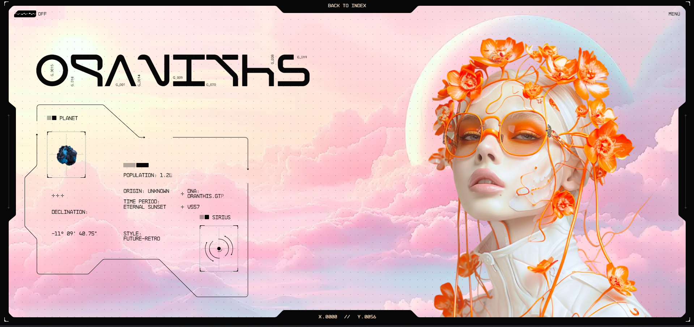

<div align="center">
  
  <h1>🧠 Oraniths</h1>
  <p><strong>Natural Language Knowledge Graph Explorer (AI-Powered)</strong></p>
  
  <p>
    <a href="https://p-dich.vercel.app/oraniths.html"><strong>Live Demo & Concept Showcase</strong></a>
  </p>
  
  <p>
    <a href="https://github.com/PraisonLabs/oraniths/stargazers">
      
    </a>
    <a href="https://github.com/PraisonLabs/oraniths/blob/main/LICENSE">
      
    </a>
    <a href="https://github.com/PraisonLabs/oraniths/issues">
      
    </a>
  </p>
  
  <p>
    <em>Map the invisible logic of knowledge</em>
  </p>
</div>

---

## 🧠 Overview

**Oraniths** is an AI-powered graph explorer that transforms natural language queries into interactive knowledge graphs. Whether you're exploring tech ecosystems or mapping science concepts, Oraniths visualizes connections with elegance and simplicity.

---

## 🔍 Features

- 🗣️ Natural Language Query Interface
- 🌐 Dynamic Graph Visualization
- 🧠 Entity Clustering & Relationships
- 🔍 Zoomable, Interactive Node Explorer
- 🛠 Extensible Dataset Loader System

---

## ⚙️ Tech Stack

| Layer        | Technology                      |
|--------------|----------------------------------|
| Frontend     | React, Tailwind CSS, D3.js       |
| Backend      | Node.js, Express, GPT SDK        |
| Graph Engine | Cytoscape.js, Sigma.js           |
| NLP Parsing  | OpenAI, Custom Rules Engine      |

---

## 📁 Project Structure

```bash
oraniths/
├── src/
│   ├── frontend/          # React + graph UI
│   ├── backend/           # Fake NLP + graph builder
│   └── graph/             # Concept linking logic
├── assets/                # Banner, demos
├── .env.example
├── README.md
└── package.json
```

---

## 🚀 Getting Started

```bash
git clone https://github.com/PraisonLabs/oraniths.git
cd oraniths
npm install
cp .env.example .env
npm run dev
```

---

## 🖼 Demo Preview

| Query Panel                      | Graph Result                      |
| -------------------------------- | --------------------------------- |
|  |  |

---

## 🎨 Concept Showcase

The project's visual identity and conceptual foundation are inspired by the [Oraniths digital art showcase](https://p-dich.vercel.app/oraniths.html).

> Dripping citrus dreams, sparking tangerine rebellion.<br/>
> Neon Veins: Pulsing streams of liquid fire, channeling cosmic energy.<br/>
> Amber Exoskin: Bio-engineered armor, infused with ancient solar code.


---

## 🌌 Future Plans

* 🧠 Wikipedia Entity Linking
* 🎙️ Voice-Driven Search Mode
* 📁 Multi-graph Management
* 🔌 SPARQL + Wikidata API support

---

## 📜 License

Licensed under the [MIT License](./LICENSE)

---

## �� About

Built by [@PraisonLabs](https://github.com/PraisonLabs)
A visual exploration concept – not for production use.

> *Oraniths helps you map the invisible logic of knowledge.*
